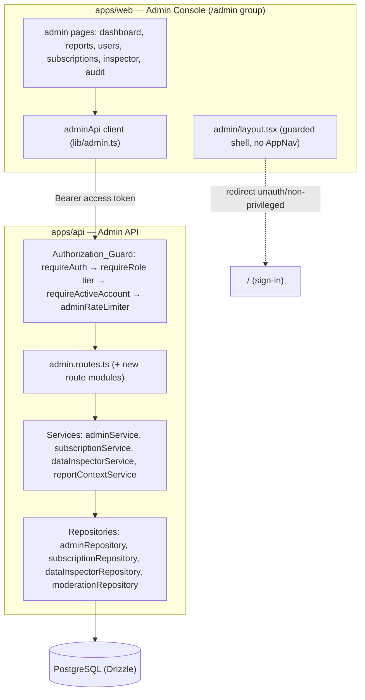
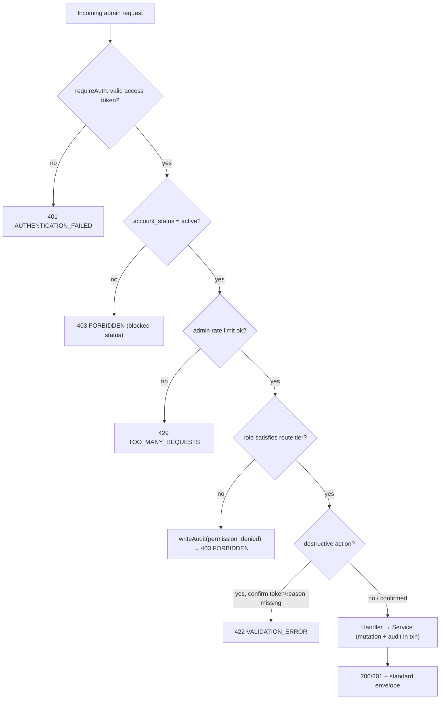
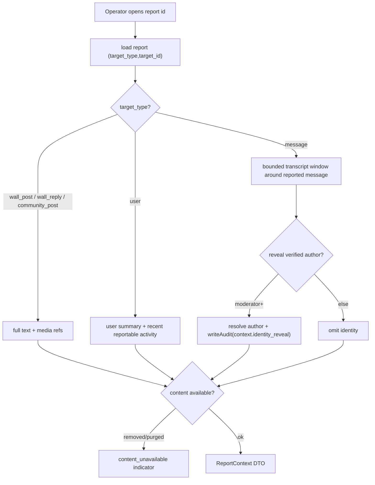

# Design Document

## Overview

The Admin Control Center extends Campusly V2's existing administration surface into a complete, hardened, admin-only operating environment. It is an **extension, not a rewrite**: every currently implemented capability — the report queue, graduated moderation actions, user status changes, feature flags, announcements, and audit-log reads — keeps its existing request/response contracts and behavior. New capability is layered on top: manual user creation (flagged), full existing-user lifecycle management, per-user subscription control (implementing the documented but as-yet-unbuilt subscription tables), report-with-context, privacy-bounded data inspection, dashboard metrics, bulk actions, destructive-action safeguards, role-tiered authorization, and admin session hardening.

The design is grounded in the authoritative docs:
- **`ADMIN_PANEL.md`** — the administration source of truth (roles §2, dashboard §3, user management §4, moderation §5, subscriptions §8, feature flags §10, audit §12, security §13).
- **`DATABASE_SCHEMA.md`** — §15 (moderation + `audit_logs`), §17 (subscription tables), §19 (system tables).
- **`AUTH_SYSTEM.md`** — §1–3 (Google-only verified onboarding), §4/§7 (RBAC), §6 (session teardown), §8 (immutable verified fields), §9 (anonymity→identity link is moderator-only).
- **`SECURITY.md`** — §4 (message access limited to participants), rate limiting, admin hardening.

Three product decisions from `requirements.md` "Documentation Alignment & Flags" are load-bearing for this design and are implemented as decided there:

1. **Manual user creation** produces a `pending_verification` account bound to a recognized institutional email domain (`universities.email_domains`), `role = student`, that must still complete Google verification before becoming `active`. It never mints a usable account directly (FLAG 2, Requirement 4).
2. **Subscriptions** are implemented per `DATABASE_SCHEMA.md` §17 via a new Drizzle migration adding `subscription_plans`, `user_subscriptions`, and `subscription_transactions`, while keeping the denormalized `users.subscription_status` cache in sync as the authoritative-state derivative (FLAG 1, Requirement 6).
3. **Private message/chat inspection** is report/investigation-scoped, moderator-only, and audit-logged — never open browsing (FLAG 3, Requirement 8).

### Design Goals

- **Backward compatibility.** No existing admin/moderation contract in `@campusly/shared-types` changes shape; new fields are additive and optional. Existing `adminService`/`adminRepository`/`admin.routes.ts` behavior is preserved.
- **Server is the only gate.** Every authorization decision is made server-side from the verified access-token claims (`req.auth`), never from client-supplied role/identity input. Client gating in the Admin Console is presentation only.
- **Accountability by construction.** Every privileged mutating action writes exactly one `audit_logs` entry per affected target, inside the same transaction as the mutation where possible.
- **Least privilege, tiered.** Moderator < Admin < Super Admin, matching `ADMIN_PANEL.md` §2. Irreversible actions require Super Admin.
- **Design-system fidelity.** The Admin Console uses semantic Tailwind tokens, `cn()`, CVA variant primitives, and `lucide-react`, per `.kiro/steering/figma-design-system.md`.

## Architecture

### High-Level Structure

The feature spans the existing monorepo boundaries without introducing new services:

- **`apps/api`** — new/extended repositories, services, routes, and middleware under the existing Express app. All admin routes remain mounted under the `/admin` prefix behind `requireAuth`.
- **`packages/shared-types`** — new DTOs and Zod schemas added to `src/admin.ts` (and a new `src/subscription.ts`), re-exported from the package index. This is the contract both apps import.
- **`apps/web`** — a new guarded admin route group with its own layout that does **not** render the student `AppNav`, composed from `components/ui/` primitives.



### Request Flow Through the Authorization_Guard

Every admin request passes through a fixed middleware chain before reaching a handler. The tier required depends on the surface (moderation = Moderator+, operational = Admin+, irreversible/role = Super Admin).



Key architectural rules:
- The guard reads role and account state **only** from verified token claims (`req.auth`), never from the request body, query, or headers other than the validated `Authorization` bearer.
- Role tiers are expressed with the existing `requireRole(...roles)` factory plus a new `SUPER_ADMIN_ROLES` set and a `requireActiveAccount` guard.
- A permission-denied outcome writes an `audit_logs` entry (`access.permission_denied`) before returning `403` (Requirement 3.6).

### Component Responsibilities

| Layer | Component | Responsibility |
|-------|-----------|----------------|
| Route | `admin.routes.ts` (extended) + `adminUsers.routes.ts`, `adminSubscriptions.routes.ts`, `adminInspector.routes.ts` | HTTP wiring, tier guards, Zod validation, pagination parsing |
| Middleware | `requireActiveAccount`, tiered `requireRole`, `adminRateLimiter`, `adminAccessLogger` | Authorization_Guard + session/access hardening |
| Service | `adminService` (extended) | Dashboard, reports, moderation, user lifecycle, flags, announcements, audit reads, bulk orchestration |
| Service | `subscriptionService` (new) | Subscription_Service: grant/revoke/change, cache sync, expiry sweep |
| Service | `dataInspectorService` (new) | Data_Inspector: read-only records, signed media URLs, message inspection (scoped) |
| Service | `reportContextService` (new) | Report_Context: resolve reported content + surrounding context |
| Repository | `adminRepository` (extended), `subscriptionRepository` (new), `dataInspectorRepository` (new) | Data access; transactional writes with audit entries |

## Components and Interfaces

### Authorization_Guard (role tiers)

Extend the existing role sets in `packages/shared-types/src/admin.ts`:

```typescript
export const MODERATOR_ROLES: UserRole[] = ['moderator', 'admin', 'super_admin']; // existing
export const ADMIN_ROLES: UserRole[] = ['admin', 'super_admin'];                   // existing
export const SUPER_ADMIN_ROLES: UserRole[] = ['super_admin'];                      // new
```

New middleware in `apps/api/src/middleware/`:

```typescript
// requireActiveAccount.ts — deny any non-active account on admin surfaces (Req 3.1)
export const requireActiveAccount: RequestHandler = (req, _res, next) => {
  const auth = getAuth(req);
  if (auth.status !== 'active') throw new ForbiddenError('Active account required.');
  next();
};

// adminAudit.ts — helper the guard uses on denial (Req 3.6)
export async function auditPermissionDenied(req: Request): Promise<void> { /* writeAudit('access.permission_denied', ...) */ }
```

Composition per route (applied after `adminRouter.use(requireAuth)`):

```typescript
const moderator  = [requireActiveAccount, requireRole(...MODERATOR_ROLES)];
const admin      = [requireActiveAccount, requireRole(...ADMIN_ROLES)];
const superAdmin = [requireActiveAccount, requireRole(...SUPER_ADMIN_ROLES)];
```

`requireRole` is wrapped so that a `ForbiddenError` on an admin route triggers `auditPermissionDenied` (via the central error handler tagging admin routes, or an explicit `adminGuardDenialLogger`). The denial audit must not depend on the handler running.

### Subscription_Service

New service `apps/api/src/services/subscriptionService.ts` and repository `subscriptionRepository.ts`. Interface:

```typescript
interface SubscriptionService {
  getForUser(userId: string): Promise<UserSubscriptionState>;                       // Req 6.1
  grant(claims, userId, input: GrantSubscriptionInput): Promise<UserSubscriptionState>; // Req 6.2
  revoke(claims, userId, input: RevokeSubscriptionInput): Promise<void>;             // Req 6.3
  change(claims, userId, input: ChangeSubscriptionInput): Promise<UserSubscriptionState>; // Req 6.4
  listPlans(): Promise<SubscriptionPlan[]>;
  startExpirySweep(): void;  // downgrades expired subs, mirrors ban sweeper (Req 6.7)
  stopExpirySweep(): void;
}
```

**Cache-sync invariant.** Every mutation runs in a single transaction: write/patch the authoritative `user_subscriptions` row, then set `users.subscription_status` to the value derived from the authoritative state (`premium` iff an `active`/`granted` subscription with `current_period_end` in the future exists, else `free`). A pure helper `deriveSubscriptionStatus(subs, now)` is the single source of the mapping and is reused by the sweep and by tests.

**Validation.** Grants/changes reject unknown or inactive plans (Req 6.5) and past expiry (Req 6.6) before any write. Expiry sweep (interval timer like the existing `startBanSweeper`) downgrades users whose active subscription's `current_period_end` has passed and writes a `subscription.auto_expire` audit entry (Req 6.7).

### Data_Inspector

New service `dataInspectorService.ts` + `dataInspectorRepository.ts`:

```typescript
interface DataInspector {
  listUsers(query: InspectorUserQuery): Promise<Paginated<AdminUser>>;        // Req 8.1 (reuses adminRepository.listUsers)
  listWallPosts(query): Promise<Paginated<InspectedPost>>;                     // Req 8.1
  listCommunityPosts(query): Promise<Paginated<InspectedPost>>;                // Req 8.1
  listMedia(query): Promise<Paginated<InspectedMediaMeta>>;                    // Req 8.1
  listAudit(cursor, limit): Promise<Paginated<AuditLogItem>>;                  // Req 8.2 (reuses moderationRepository.listAudit)
  signMediaUrl(claims, mediaId): Promise<{ url: string; expiresAt: string }>;  // Req 8.5 short-lived signed URL
  inspectConversation(claims, input: InspectConversationInput): Promise<ConversationTranscript>; // Req 8.3/8.4 moderator-only, scoped, audited
}
```

- Message/chat inspection (`inspectConversation`) requires `MODERATOR_ROLES`, requires a resolving `reportId` **or** `investigationContext`, returns a bounded transcript window, and writes an `inspection.conversation` audit entry recording actor, conversation key, and the associated report/investigation (Req 8.3, 8.4).
- Media is served only via short-lived signed URLs from the media subsystem; no permanent public URL is returned (Req 8.5).
- Purged records (per retention) are represented with a tombstone indicator rather than omitted silently (Req 8.6).

### Report_Context resolver

New service `reportContextService.ts` resolves a report into displayable context by `target_type`:



Anonymity→identity resolution is restricted to Moderator+ and audit-logged (Req 7.5); missing/purged content returns a defined `contentUnavailable` marker instead of failing (Req 7.6).

### User lifecycle (Requirement 5)

Extends `adminService` with editable-field updates, role change (Super Admin), and soft delete (Super Admin). Verified fields (`university_id`, `branch_id`, `year`) are rejected on edit (Req 5.4). Any attempt to suspend/ban/delete/role-change a `super_admin` is rejected (Req 5.6) — this preserves and generalizes the existing `setUserStatus` guard. Soft delete sets `users.deleted_at`, performs Session_Teardown, schedules PII purge, and audits (Req 5.7).

### Manual user creation (Requirement 4)

`adminService.createUser(claims, input)`:
1. Validate name, `universityId`, and email whose domain ∈ `universities.email_domains` for that university (Req 4.1, 4.2).
2. Reject if the email already belongs to an account (Req 4.3, via unique constraint + pre-check → `ConflictError`).
3. Insert `users` row with `account_status = 'pending_verification'`, `role = 'student'` (Req 4.4).
4. Write `user.create_manual` audit with actor, created user id, and `source = 'admin_manual'` (Req 4.5).

No `google_accounts` link and no password are created; the account is unusable until the student completes Google verification, satisfying `AUTH_SYSTEM.md`.

### Bulk actions (Requirement 11)

`adminService.bulkAction(claims, input)` accepts ≤100 target ids (Req 11.2), applies the action per target, and returns a per-target result array `{ targetId, ok, error? }` (Req 11.3). It writes exactly one audit entry per **successfully affected** target (Req 11.1). Destructive bulk variants require a confirmation token (Req 11.4) and, when irreversible, Super Admin (Req 12.3).

### Web Admin Console (Requirements 2, 15)

Route group `apps/web/app/admin/` restructured:

```
app/admin/
  layout.tsx        # guarded admin shell; NO <AppNav>; redirects unauth/non-privileged
  page.tsx          # dashboard (default)
  reports/page.tsx  # report queue + Report_Context drawer
  users/page.tsx    # user list/search/filter, lifecycle, manual create, subscription panel
  subscriptions/page.tsx
  inspector/page.tsx
  audit/page.tsx
components/admin/
  AdminShell.tsx    # sidebar nav (lucide icons), tier-aware links
  ConfirmDialog.tsx # destructive-action confirmation (CVA), names action/target/reversibility + reason field
  DataTable.tsx     # paginated table with cursor "load more"
  StatCard.tsx      # dashboard metric card
```

- `admin/layout.tsx` uses `useRequireAuth`; if unauthenticated → redirect to sign-in (Req 2.4); if authenticated but role ∉ `MODERATOR_ROLES` → redirect to `/` without rendering admin content (Req 2.3). It renders no `AppNav` (Req 2.1) and the main student nav contains no admin link (Req 2.2 — remove any such entry).
- New primitives are added to `components/ui/` only if not already present (Badge, Dialog, Select, Table) following the `Button.tsx` CVA + `forwardRef` + `cn()` + `displayName` pattern (Req 15.2). Styling uses semantic tokens and named spacing/radius only (Req 15.1, 15.3). Controls carry accessible names, ≥44px targets, and visible focus rings (Req 15.4).

### Shared-types contracts to add

Added to `packages/shared-types/src/admin.ts` (and new `subscription.ts`), re-exported from the index. Existing exports are unchanged.

```typescript
// --- Subscriptions (DATABASE_SCHEMA.md §17) ---
export const SUBSCRIPTION_PLAN_INTERVALS = ['none', 'monthly', 'yearly'] as const;
export const USER_SUBSCRIPTION_STATUSES = ['active', 'cancelled', 'expired', 'granted'] as const;
export const SUBSCRIPTION_SOURCES = ['purchase', 'admin_grant', 'trial'] as const;

export interface SubscriptionPlan {
  id: string; code: string; name: string;
  priceCents: number; currency: string;
  interval: (typeof SUBSCRIPTION_PLAN_INTERVALS)[number];
  isActive: boolean;
}
export interface UserSubscriptionState {
  userId: string;
  plan: SubscriptionPlan | null;
  status: (typeof USER_SUBSCRIPTION_STATUSES)[number] | null;
  source: (typeof SUBSCRIPTION_SOURCES)[number] | null;
  currentPeriodEnd: string | null;
  cachedStatus: SubscriptionStatus; // users.subscription_status
}

export const GrantSubscriptionSchema = z.object({
  planId: z.string().uuid(),
  currentPeriodEnd: z.string().datetime(),
  reason: z.string().trim().max(1000).optional(),
});
export const ChangeSubscriptionSchema = z.object({
  planId: z.string().uuid().optional(),
  currentPeriodEnd: z.string().datetime().optional(),
  reason: z.string().trim().max(1000).optional(),
}).refine((v) => v.planId || v.currentPeriodEnd, 'Provide planId or currentPeriodEnd');
export const RevokeSubscriptionSchema = z.object({ reason: z.string().trim().max(1000).optional() });

// --- Manual user creation (Req 4) ---
export const CreateUserSchema = z.object({
  name: z.string().trim().min(1).max(120),
  email: z.string().trim().toLowerCase().email(),
  universityId: z.string().uuid(),
});

// --- Editable user fields / role change / delete (Req 5) ---
export const EditUserSchema = z.object({
  name: z.string().trim().min(1).max(120).optional(),
  bio: z.string().trim().max(500).optional(),
  avatarMediaId: z.string().uuid().nullable().optional(),
}); // verified fields intentionally absent
export const ChangeRoleSchema = z.object({
  role: z.enum(['student','community_moderator','club_admin','moderator','admin','super_admin']),
  reason: z.string().trim().min(1).max(1000),
});
export const DeleteUserSchema = z.object({
  confirm: z.literal(true),
  reason: z.string().trim().min(1).max(1000),
});

// --- Bulk + destructive confirmation (Req 11, 12) ---
export const BulkActionSchema = z.object({
  action: z.enum(['restrict','ban','delete','revoke_subscription']),
  targetIds: z.array(z.string().uuid()).min(1).max(100),
  reason: z.string().trim().max(1000).optional(),
  confirm: z.literal(true).optional(), // required by service for destructive variants
});
export interface BulkActionResult { targetId: string; ok: boolean; error: string | null; }

// --- Report context (Req 7) ---
export interface ReportContext {
  report: AdminReport;
  target: {
    kind: 'message' | 'wall_post' | 'wall_reply' | 'community_post' | 'user';
    content: unknown;               // shape depends on kind
    transcript?: TranscriptMessage[]; // for message targets
    contentUnavailable?: boolean;   // Req 7.6
  };
}

// --- Data inspector (Req 8) ---
export const InspectConversationSchema = z.object({
  contextType: z.enum(['anon_session','friendship']),
  conversationId: z.string().uuid(),
  reportId: z.string().uuid().optional(),
  investigationContext: z.string().trim().max(500).optional(),
}).refine((v) => v.reportId || v.investigationContext, 'Report or investigation context required');
```

### API surface (additions; existing routes preserved)

| Method & Path | Tier | Purpose | Requirement |
|---|---|---|---|
| `POST /admin/users` | Admin | Manual create (pending_verification) | 4 |
| `PATCH /admin/users/:id` | Admin | Edit permitted fields | 5.3, 5.4 |
| `PATCH /admin/users/:id/role` | Super Admin | Change role | 5.5 |
| `DELETE /admin/users/:id` | Super Admin | Soft delete + purge schedule | 5.7 |
| `GET /admin/users/:id/subscription` | Admin | View subscription state | 6.1 |
| `POST /admin/users/:id/subscription/grant` | Admin | Grant | 6.2 |
| `POST /admin/users/:id/subscription/revoke` | Admin | Revoke | 6.3 |
| `PATCH /admin/users/:id/subscription` | Admin | Change plan/expiry | 6.4 |
| `GET /admin/subscription-plans` | Admin | List plans | 6.5 |
| `GET /admin/reports/:id/context` | Moderator | Report_Context | 7 |
| `GET /admin/inspector/(posts\|community-posts\|media)` | Admin | Read-only records | 8.1 |
| `POST /admin/inspector/conversation` | Moderator | Scoped message inspection | 8.3, 8.4 |
| `GET /admin/inspector/media/:id/url` | Admin | Short-lived signed URL | 8.5 |
| `POST /admin/bulk-actions` | Admin (Super Admin if irreversible) | Bulk apply | 11 |

Existing routes (`/admin/dashboard`, `/admin/reports`, `/admin/reports/:id`, `/admin/moderation/*`, `/admin/users`, `/admin/users/:id`, `/admin/users/:id/status`, `/admin/feature-flags*`, `/admin/announcements*`, `/admin/audit-logs`) keep their contracts and gating.

## Data Models

### New subscription tables (Drizzle migration, `DATABASE_SCHEMA.md` §17)

New enums and tables added to `apps/api/src/db/schema.ts`, generated into a new migration (`0011_*`). The existing `subscriptionStatusEnum` (`free`/`premium`) on `users` is retained as the denormalized cache.

```typescript
export const subscriptionIntervalEnum = pgEnum('subscription_interval', ['none', 'monthly', 'yearly']);
export const userSubscriptionStatusEnum = pgEnum('user_subscription_status', ['active', 'cancelled', 'expired', 'granted']);
export const subscriptionSourceEnum = pgEnum('subscription_source', ['purchase', 'admin_grant', 'trial']);
export const subscriptionTxnTypeEnum = pgEnum('subscription_txn_type', ['payment', 'refund']);
export const subscriptionTxnStatusEnum = pgEnum('subscription_txn_status', ['pending', 'succeeded', 'failed']);

export const subscriptionPlans = pgTable('subscription_plans', {
  id: uuid('id').primaryKey().defaultRandom(),
  code: text('code').notNull(),
  name: text('name').notNull(),
  priceCents: integer('price_cents').notNull().default(0),
  currency: text('currency').notNull().default('INR'),
  interval: subscriptionIntervalEnum('interval').notNull(),
  features: jsonb('features').notNull().default({}),
  isActive: boolean('is_active').notNull().default(true),
  createdAt: timestamp('created_at', { withTimezone: true }).notNull().defaultNow(),
}, (t) => ({ codeUnique: unique('uq_subscription_plans_code').on(t.code) }));

export const userSubscriptions = pgTable('user_subscriptions', {
  id: uuid('id').primaryKey().defaultRandom(),
  userId: uuid('user_id').notNull().references(() => users.id, { onDelete: 'cascade' }),
  planId: uuid('plan_id').notNull().references(() => subscriptionPlans.id),
  status: userSubscriptionStatusEnum('status').notNull(),
  source: subscriptionSourceEnum('source').notNull(),
  startedAt: timestamp('started_at', { withTimezone: true }).notNull().defaultNow(),
  currentPeriodEnd: timestamp('current_period_end', { withTimezone: true }),
  cancelledAt: timestamp('cancelled_at', { withTimezone: true }),
  createdAt: timestamp('created_at', { withTimezone: true }).notNull().defaultNow(),
}, (t) => ({
  // Partial index for entitlement checks: at most one live sub per user is expected.
  activeIdx: index('idx_user_subscriptions_active').on(t.userId).where(sql`status in ('active','granted')`),
  periodEndIdx: index('idx_user_subscriptions_period_end').on(t.currentPeriodEnd),
}));

export const subscriptionTransactions = pgTable('subscription_transactions', {
  id: uuid('id').primaryKey().defaultRandom(),
  subscriptionId: uuid('subscription_id').notNull().references(() => userSubscriptions.id, { onDelete: 'cascade' }),
  amountCents: integer('amount_cents').notNull(),
  currency: text('currency').notNull().default('INR'),
  type: subscriptionTxnTypeEnum('type').notNull(),
  status: subscriptionTxnStatusEnum('status').notNull(),
  provider: text('provider'),
  providerRef: text('provider_ref'),
  createdAt: timestamp('created_at', { withTimezone: true }).notNull().defaultNow(),
}, (t) => ({
  providerRefUnique: unique('uq_subscription_txn_provider_ref').on(t.provider, t.providerRef),
  subscriptionIdx: index('idx_subscription_txn_subscription').on(t.subscriptionId),
}));

export type SubscriptionPlanRow = typeof subscriptionPlans.$inferSelect;
export type UserSubscriptionRow = typeof userSubscriptions.$inferSelect;
export type SubscriptionTransactionRow = typeof subscriptionTransactions.$inferSelect;
```

**Migration seeds** a `free` plan (`code='free'`, `price_cents=0`, `interval='none'`) and at least one `premium` plan (`code='premium_monthly'`) so grants have a target (aligns with `FEATURE_MATRIX.md` §14). Admin-grant flows use `source='admin_grant'`, `status='granted'`; no `subscription_transactions` row is written for comp grants (transactions are for billing events only).

### Authoritative-state → cache derivation

`users.subscription_status` is a pure function of `user_subscriptions` at a point in time:

```
deriveSubscriptionStatus(subs, now) =
  'premium'  if ∃ s ∈ subs: s.status ∈ {active, granted} ∧ (s.currentPeriodEnd is null ∨ s.currentPeriodEnd > now)
  'free'     otherwise
```

This function is applied inside every mutation transaction and by the expiry sweep, guaranteeing the cache never diverges from authoritative state (Correctness Property 1).

### `audit_logs` usage (existing table, `DATABASE_SCHEMA.md` §15.7)

No schema change. New namespaced action keys are introduced (all lowercase, dotted):

| Action key | Written when | actor_id |
|---|---|---|
| `user.create_manual` | Manual user creation | Operator |
| `user.edit` | Editable field change | Operator |
| `user.role_change` | Role change (metadata: `{ from, to }`) | Super Admin |
| `user.delete` | Soft delete | Super Admin |
| `subscription.grant` / `.revoke` / `.change` | Subscription mutations | Operator |
| `subscription.auto_expire` | Expiry sweep downgrade | null (system) |
| `inspection.conversation` | Scoped message inspection | Operator |
| `context.identity_reveal` | Anonymity→identity resolution in Report_Context | Operator |
| `access.permission_denied` | Guard rejects a privileged request | Operator (or null if unauth reached guard) |
| `admin.access` | Admin Console access (metadata: hashed client address) | Operator |

Metadata excludes secrets and unnecessary PII (Req 13.5). Append-only is enforced by policy/permissions (Req 13.2); the app performs only `INSERT`/`SELECT` on `audit_logs`.

### Indexes summary

- `subscription_plans`: unique `code`.
- `user_subscriptions`: partial index on `user_id` where `status in ('active','granted')` (entitlement lookups); index on `current_period_end` (expiry sweep).
- `subscription_transactions`: unique `(provider, provider_ref)`; index on `subscription_id`.
- Reuses existing `audit_logs` indexes (`actor_id,created_at`), `(target_type,target_id)`, `action`) and `reports`/`users` indexes for inspection/search.

### Users table (no structural change)

No new columns are required on `users`. `deleted_at` already exists for soft delete; `subscription_status` already exists as the cache; verified fields (`university_id`, `branch_id`, `year`) already exist and remain immutable via service-layer rejection.

## Correctness Properties

*A property is a characteristic or behavior that should hold true across all valid executions of a system — essentially, a formal statement about what the system should do. Properties serve as the bridge between human-readable specifications and machine-verifiable correctness guarantees.*

These properties are derived from the acceptance-criteria prework and consolidated to remove redundancy (e.g., the many "writes an audit entry" criteria collapse into a single per-target invariant; the authorization criteria collapse into a tiered-authorization property plus a client-input-independence property; the subscription cache-sync criteria collapse into one authoritative-state invariant). Each is written for property-based testing over generated inputs, using in-memory/mocked repositories where external I/O (sockets, media signing) is involved.

### Property 1: Subscription cache always matches authoritative state

*For any* user and *any* sequence of subscription operations (grant, revoke, change) and expiry sweeps, after each operation completes the value of `users.subscription_status` equals `deriveSubscriptionStatus(user_subscriptions_for_user, now)` — i.e., `premium` iff there exists a subscription with status in `{active, granted}` whose `current_period_end` is null or in the future, and `free` otherwise.

**Validates: Requirements 6.2, 6.3, 6.4, 6.7**

### Property 2: Exactly one audit entry per affected target

*For any* privileged mutating action (manual create, edit, role change, delete, status change, moderation action, subscription grant/revoke/change, message inspection, and each target of a bulk action), the operation writes **exactly one** `audit_logs` entry per successfully affected target, and that entry records the acting operator id (or null for system actions), a namespaced action key, the target type, the target id, and a timestamp.

**Validates: Requirements 1.2, 4.5, 5.2, 5.3, 5.5, 6.2, 6.3, 6.4, 8.4, 11.1, 12.4, 13.1**

### Property 3: Tiered authorization is enforced by role

*For any* admin request and *any* user role, the request reaches its handler if and only if the account is authenticated and `active` **and** the role satisfies the route's required tier (moderation ⇒ role ∈ MODERATOR_ROLES; operational ⇒ role ∈ ADMIN_ROLES; role-management/irreversible ⇒ role = super_admin). Otherwise the request is rejected with an authorization error and no mutation occurs.

**Validates: Requirements 2.3, 3.1, 3.2, 3.3, 3.4, 3.5, 12.3, 14.1**

### Property 4: Authorization decisions never depend on client input

*For any* admin request, the authorization outcome is identical whether or not the request body, query, or non-authorization headers contain role, `userId`, `isAdmin`, or similar identity fields — the decision is a function only of the verified access-token claims. Injecting privileged-looking client fields never grants access.

**Validates: Requirements 2.5, 3.5**

### Property 5: Permission-denied requests are audited

*For any* privileged request rejected by the Authorization_Guard for insufficient role, exactly one `access.permission_denied` audit entry is written before the error response is returned.

**Validates: Requirements 3.6**

### Property 6: Verified fields are immutable through admin edits

*For any* user and *any* edit request, the fields `university_id`, `branch_id`, and `year` are unchanged after the operation; a request that attempts to modify any of them is rejected with a descriptive error and produces no field change.

**Validates: Requirements 5.4**

### Property 7: Super Admins cannot be moderated, deleted, or re-roled by the flow

*For any* operator and *any* target whose role is `super_admin`, an attempt to suspend, ban, delete, or change the role of that target is rejected and the target's status and role are unchanged.

**Validates: Requirements 5.6**

### Property 8: Suspend/ban/delete transitions force session teardown

*For any* user transitioned to `suspended`, `banned`, or soft-deleted, Session_Teardown is performed exactly for that user (refresh tokens revoked and a disconnect signal emitted), and it is not performed for transitions to `active` or `restricted`.

**Validates: Requirements 1.3, 5.2, 5.7**

### Property 9: Expired temporary bans auto-lift on sweep

*For any* set of user bans with arbitrary past/future `ends_at`, running the ban sweep lifts exactly the temporary bans whose `ends_at` is in the past and restores their affected users to `active` (when currently suspended/restricted), leaving future-dated and permanent bans untouched.

**Validates: Requirements 1.4**

### Property 10: Manual creation yields a pending, student, verification-bound account

*For any* valid manual-creation input (name, `university_id`, and email whose domain is in that university's `email_domains`), the created user has `account_status = pending_verification` and `role = student`, and has no usable credential (no `google_accounts` link, no password) until Google verification completes.

**Validates: Requirements 4.1, 4.4**

### Property 11: Invalid privileged input is rejected without side effects

*For any* privileged request that is invalid — unrecognized institutional email domain (create), an email already belonging to an account (create), an unknown or inactive subscription plan (grant/change), a `current_period_end` earlier than now (grant/change), or a required reason missing (destructive action) — the request is rejected with a descriptive error and no row is created, updated, or deleted.

**Validates: Requirements 4.2, 4.3, 6.5, 6.6, 12.5**

### Property 12: No destructive action executes without confirmation

*For any* destructive action (single or bulk: delete, permanent ban, role change, subscription revocation), the action executes only when an explicit confirmation indicator is present in the request; absent confirmation, the request is rejected and no target is affected.

**Validates: Requirements 11.4, 12.2**

### Property 13: Report context resolves the reported content correctly

*For any* report, opening its context returns the report metadata together with content resolved from its `target_type`/`target_id`: for a `message`, a bounded transcript window drawn from the same conversation that includes the reported message and whose size does not exceed the configured bound; for `wall_post`/`wall_reply`/`community_post`, the full text and media references of that content; for a `user`, the user's summary.

**Validates: Requirements 7.1, 7.2, 7.3**

### Property 14: Missing or purged content degrades gracefully

*For any* report whose target has been removed or purged, resolving its context returns a defined `contentUnavailable` indicator and never throws or fails the request.

**Validates: Requirements 7.6**

### Property 15: Identity reveal is moderator-gated and audited

*For any* Report_Context request that would resolve the verified author of anonymous content, resolution occurs only when the operator's role is in MODERATOR_ROLES, and each successful resolution writes exactly one `context.identity_reveal` audit entry.

**Validates: Requirements 7.5**

### Property 16: Message inspection requires moderator role and an explicit scope

*For any* conversation-inspection request, private message content is returned only when the operator's role is in MODERATOR_ROLES **and** the request carries a resolving `reportId` or `investigationContext`; otherwise access is denied. Every successful inspection writes exactly one `inspection.conversation` audit entry recording the operator, the conversation, and the associated report/investigation.

**Validates: Requirements 8.3, 8.4**

### Property 17: Data inspection is read-only

*For any* sequence of Data_Inspector read operations over users, posts, community posts, media metadata, or the audit log, no persisted record is created, updated, or deleted as a result.

**Validates: Requirements 8.1, 8.2**

### Property 18: Media is served only via short-lived signed URLs

*For any* media asset served by the Data_Inspector, the returned URL carries an expiry timestamp in the future and is a signed, time-bounded URL — never a permanent public URL.

**Validates: Requirements 8.5**

### Property 19: Purged records surface as tombstones

*For any* record whose fields have been hard-purged under the retention policy, the Data_Inspector presents a tombstone indicator for that record and does not include the purged field values in the response.

**Validates: Requirements 8.6**

### Property 20: Pagination is bounded and cursor-consistent

*For any* list request over users, reports, or audit entries with any requested limit, the number of returned records is at most `min(requestedLimit, 100)` with a default of 50 when unspecified; a `nextCursor` is returned exactly when further records exist beyond the page and is null otherwise; and the audit-log listing is returned in strictly reverse-chronological order.

**Validates: Requirements 8.1, 8.2, 9.1, 9.2, 13.4**

### Property 21: Search and status filters are sound and complete

*For any* set of users and any search term, the user search returns exactly those users whose name or email contains the term case-insensitively; and *for any* set of reports and any requested status set, the report queue returns exactly those reports whose status is in the requested set.

**Validates: Requirements 9.3, 9.4**

### Property 22: Dashboard metrics are correct and resilient

*For any* platform dataset, each dashboard count equals an independent recount of the corresponding records; and if any single metric computation fails, that metric is returned as a defined zero/unavailable value while the remaining metrics are still returned.

**Validates: Requirements 10.1, 10.4**

### Property 23: Bulk actions produce per-target results and isolate failures

*For any* bulk action over a set of valid and invalid target ids, the response contains exactly one result entry per input id indicating success or failure, every valid target has the action applied, and a failure on one target does not prevent application to the remaining valid targets.

**Validates: Requirements 11.3**

### Property 24: System-initiated actions are attributed to the system

*For any* system-initiated privileged action (ban auto-lift, subscription auto-expire), the resulting audit entry has a null actor id and a distinguishing action key (`ban.auto_lift`, `subscription.auto_expire`).

**Validates: Requirements 13.3**

### Property 25: Recorded admin access addresses are hashed

*For any* admin access record, the stored client address is a one-way hash and never the raw client address.

**Validates: Requirements 14.4**

## Error Handling

Error handling reuses the platform's centralized model: services throw typed `AppError` subclasses (`ValidationError`, `AuthenticationError`, `UnauthorizedError`, `ForbiddenError`, `NotFoundError`, `ConflictError` from `apps/api/src/domain/errors.ts`); the central error handler maps them to the standard `{ error: { code, message, details? } }` envelope via `ERROR_CODES`/`ERROR_HTTP_STATUS`. Strings are never thrown directly. Zod validation failures at the route layer surface as `VALIDATION_ERROR`.

| Condition | Error | HTTP | Notes |
|---|---|---|---|
| Missing/invalid access token | `AuthenticationError` | 401 | From `requireAuth`; unchanged |
| Non-active account on admin surface | `ForbiddenError` | 403 | `requireActiveAccount` (Req 3.1) |
| Insufficient role for route tier | `ForbiddenError` | 403 | Writes `access.permission_denied` audit first (Req 3.6, Property 5) |
| Rate limit exceeded | `TOO_MANY_REQUESTS` | 429 | `adminRateLimiter` envelope (Req 14.3) |
| Manual create: unrecognized domain | `ValidationError` | 422 | No user created (Req 4.2, Property 11) |
| Manual create: email already exists | `ConflictError` | 409 | Pre-check + DB unique constraint backstop (Req 4.3) |
| Edit targets a verified field | `ValidationError` | 422 | No field changed (Req 5.4, Property 6) |
| Moderate/delete/re-role a super_admin | `ForbiddenError` | 403 | No change (Req 5.6, Property 7) |
| Role change without super_admin | `ForbiddenError` | 403 | Tier guard (Req 5.5) |
| Grant/change: unknown or inactive plan | `ValidationError` | 422 | No subscription change (Req 6.5) |
| Grant/change: past `currentPeriodEnd` | `ValidationError` | 422 | (Req 6.6) |
| Destructive action without confirmation | `ValidationError` | 422 | (Req 12.2, 11.4, Property 12) |
| Destructive action missing required reason | `ValidationError` | 422 | (Req 12.5) |
| Bulk > 100 targets | `ValidationError` | 422 | Zod `.max(100)` (Req 11.2) |
| Message inspection without scope or role | `ForbiddenError` / `ValidationError` | 403 / 422 | Missing role ⇒ 403; missing scope ⇒ 422 (Req 8.3) |
| Report context: target removed/purged | none (soft) | 200 | Returns `contentUnavailable` marker, no throw (Req 7.6, Property 14) |
| Dashboard metric computation fails | none (soft) | 200 | Failed metric defaulted; response still returned (Req 10.4, Property 22) |
| Target record not found | `NotFoundError` | 404 | User/report/subscription lookups |

**Transactional integrity.** Every mutation-plus-audit and subscription-mutation-plus-cache-sync runs inside a single `db.transaction` (consistent with `moderationRepository.applyAction`). If the audit insert or cache sync fails, the whole action rolls back — there is no partial state where a mutation lands without its audit entry, or where the cache diverges from authoritative state.

**Bulk isolation.** Bulk actions process targets independently; a per-target failure is captured in that target's result entry (`{ ok: false, error }`) and does not abort the batch (Req 11.3). Each successful target still commits its own mutation+audit transaction.

## Testing Strategy

### Dual approach

- **Unit tests** cover specific examples, edge cases, and error conditions: DTO shapes (6.1, 7.4), the `deriveSubscriptionStatus` mapping table, boundary values (page size exactly 100/101, bulk exactly 100/101), and error mappings above.
- **Property-based tests** cover the universal invariants in the Correctness Properties section across generated inputs.
- **Integration tests** cover contract preservation (Req 1.1), rate-limiting wiring (14.3), and audit append-only enforcement at the DB permission layer (13.2).
- **Web tests** cover the guarded layout (redirect for unauthenticated 2.4 and non-privileged 2.3), absence of `AppNav`/admin nav links (2.1, 2.2), theme snapshots (15.3), and accessibility (axe + touch-target/focus assertions, 15.4).

### Property-based testing

PBT applies to this feature because the core logic — subscription cache derivation, audit accounting, authorization predicates, validation, pagination, search/filter, and report resolution — consists of pure or mockable functions with universal invariants over large input spaces.

- **Library:** `fast-check` with the existing test runner (Vitest) in `apps/api`. Do not hand-roll generators for framework concerns.
- **Iterations:** each property test runs a minimum of **100** iterations (`fc.assert(..., { numRuns: 100 })`).
- **Isolation:** repositories are backed by an in-memory fake (or a transactional test DB) so properties exercise service logic without real sockets or object storage; the media signer and `notifier` are mocked and asserted against.
- **Tagging:** each property test references its design property with a comment in the form:
  `// Feature: admin-control-center, Property {number}: {property_text}`
- **Coverage:** implement one property-based test per Correctness Property (Properties 1–25). Generators include adversarial inputs required by the prework edge cases: mixed-case emails and non-institutional domains (10, 11, 21), timestamps straddling `now` (1, 9, 11), client bodies carrying injected `role`/`userId`/`isAdmin` fields (4), target sets mixing valid and invalid ids and crossing the 100 boundary (20, 23), conversations of varying length for transcript windows (13), and records flagged as purged (19).

### Key test scenarios by area

| Area | Representative tests |
|---|---|
| Authorization | Property 3/4/5; unit tests for each tier guard; injected client-role rejection |
| Subscriptions | Property 1 (op-sequence + sweep); `deriveSubscriptionStatus` unit table; Property 11 invalid plan/expiry |
| Audit | Property 2 across every mutation type; Property 24 system attribution; integration test that app never issues UPDATE/DELETE on `audit_logs` |
| User lifecycle | Property 6 (verified immutability), 7 (super_admin protection), 8 (teardown), 10 (manual create) |
| Report context / inspection | Property 13/14/15/16; media signing Property 18; tombstone Property 19 |
| Lists | Property 20 (pagination), 21 (search/filter) |
| Bulk & destructive | Property 12, 23; boundary unit tests at 100 |
| Web console | Layout guard redirects, no-AppNav, theme snapshots, a11y |

### Verification

After implementation, run `pnpm --filter @campusly/api test` and `pnpm --filter @campusly/api typecheck`, plus `pnpm --filter @campusly/web typecheck` and `lint`, and generate/apply the new Drizzle migration (`drizzle-kit generate` + `migrate`) in a disposable database to confirm the subscription tables and seed apply cleanly. Property tests must pass at ≥100 iterations before the feature is considered complete.
