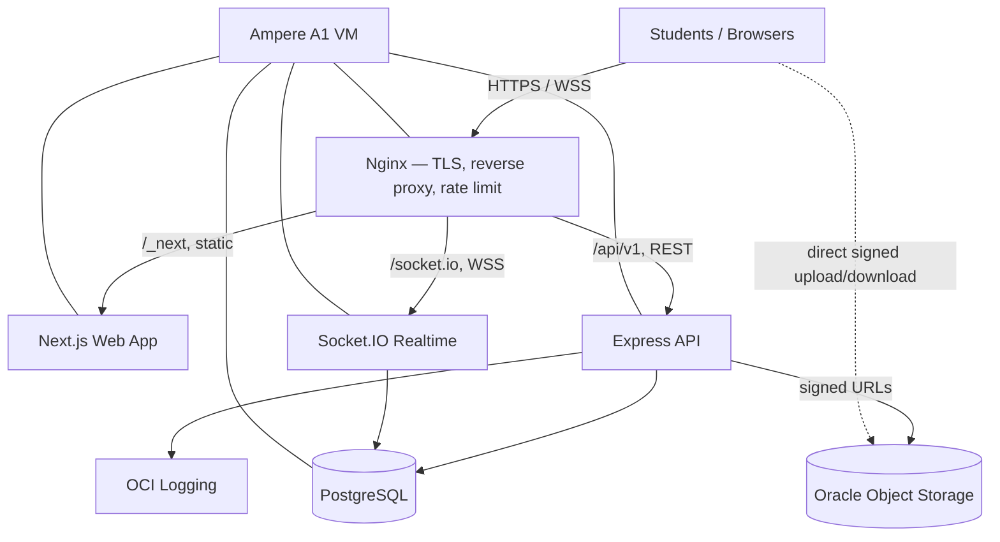
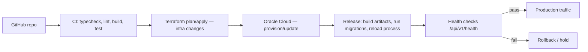

# Campusly V2 — Cloud Infrastructure Blueprint

> **Document type:** Infrastructure specification — single source of truth
> **Product:** Campusly V2 (formerly PU Chat)
> **Status:** Authoritative v1.0
> **Authority:** This is the definitive blueprint for Campusly's cloud infrastructure: Oracle Cloud services, deployment architecture, networking, storage, security, monitoring, Terraform strategy, and operational standards. All provisioning and operations MUST conform. It defines architecture and engineering decisions only — no Terraform code, shell scripts, or deployment commands (those live with the deployment runbook).
> **Companion documents:** `TECH_STACK.md` §8 (storage), `ARCHITECTURE.md` §2, §9, §14 (runtime topology, media, edge), `SECURITY.md` §10, §16 (secrets, edge hardening), `DATABASE_SCHEMA.md` (data model & lifecycle), `implementation/15_DEPLOYMENT.md` (the deployment runbook), `PROJECT_VISION.md` §11 (near-zero-cost validation)

---

## Table of Contents
1. [Infrastructure Philosophy](#1-infrastructure-philosophy)
2. [Oracle Cloud Services](#2-oracle-cloud-services)
3. [Infrastructure Architecture](#3-infrastructure-architecture)
4. [Network Architecture](#4-network-architecture)
5. [Compute Strategy](#5-compute-strategy)
6. [Storage Strategy](#6-storage-strategy)
7. [Database Infrastructure](#7-database-infrastructure)
8. [Terraform Strategy](#8-terraform-strategy)
9. [Secrets Management](#9-secrets-management)
10. [Monitoring](#10-monitoring)
11. [Backup & Disaster Recovery](#11-backup--disaster-recovery)
12. [Deployment Pipeline](#12-deployment-pipeline)
13. [Cost Optimization](#13-cost-optimization)
14. [Future Scaling](#14-future-scaling)
15. [Infrastructure Principles](#15-infrastructure-principles)

---

## 1. Infrastructure Philosophy

Campusly's infrastructure is built to validate a real product with real students at **near-zero cost** (`PROJECT_VISION.md` §11), while being engineered so the path to paid scale is a configuration change, not a rewrite.

- **Cloud-first.** All environments run on Oracle Cloud Infrastructure (OCI). There are no hand-pet servers; every resource is declared, reproducible, and disposable. Local development mirrors production topology (a single Node process serving Express + Socket.IO, PostgreSQL, object storage) so behavior is consistent across environments.
- **Infrastructure as Code (IaC) from day one.** Every cloud resource — network, compute, storage, database, DNS, IAM, monitoring — is defined in **Terraform** (§8). Nothing is created by hand in the console except the bootstrap tenancy and the Terraform state backend. This makes the entire platform auditable, diffable, and re-creatable in another region or tenancy.
- **Cost optimization.** The architecture is deliberately sized to fit the **OCI Always Free** tier (§2, §13). Bytes live in object storage, not the database (`TECH_STACK.md` §8); temporary media auto-expires; a single Ampere ARM VM hosts the whole stack. Cost is a first-class design constraint, not an afterthought.
- **Simplicity (KISS).** A **modular monolith** on one VM (`ARCHITECTURE.md` §2.3) avoids premature microservices, Kubernetes, and managed-service sprawl. Fewer moving parts means fewer failure modes and a stack a solo operator or tiny team can run confidently.
- **Security by default.** Private-by-default networking, least-privilege IAM, secrets never in code or state, TLS everywhere, and an Nginx hardening layer at the edge (`SECURITY.md` §16). The infrastructure assumes a hostile internet.
- **Scalability.** Every component has a documented, low-friction upgrade path (§14): add a load balancer and a second VM, introduce Redis for the Socket.IO adapter and matching pool, promote PostgreSQL to read replicas, front object storage with a CDN — each introduced only when metrics justify it.
- **Disaster recovery.** Automated database backups to object storage, versioned configuration, and IaC mean the platform can be rebuilt from code + the latest backup with bounded RTO/RPO (§11).

---

## 2. Oracle Cloud Services

Campusly runs on the **OCI Always Free** allowances, which are generous enough to host the full validation-stage platform. The Ampere A1 (ARM) allotment (up to 4 OCPUs / 24 GB RAM, always free) is the centerpiece.

| Service | Purpose | Why selected | Always Free eligibility | Key limitations | Future migration |
|---------|---------|--------------|-------------------------|-----------------|------------------|
| **Compute — Ampere A1 (ARM)** | Hosts Nginx + Node (Next.js, Express, Socket.IO) and PostgreSQL | Generous free ARM capacity (4 OCPU / 24 GB); ample for a modular monolith | Up to 4 OCPU + 24 GB RAM free | ARM-only images; single AD; capacity contention in some regions | Resize shape / add VMs behind a Load Balancer (§14) |
| **Block Storage (Boot + Block Volume)** | OS disk, app, PostgreSQL data, local backups | Durable, snapshot-capable persistent disk | Up to 200 GB total free | IOPS scales with size; single-AD durability | Larger/performance volumes; move DB to its own volume |
| **Object Storage** | Media bytes (avatars, voice, images), DB backups, logs archive | The "bytes in object storage, references in DB" rule (`TECH_STACK.md` §8) | 20 GB free + 50k requests/mo | Eventual listing consistency; egress costs at scale | Add CDN; lifecycle to Archive tier |
| **Virtual Cloud Network (VCN)** | Private network boundary for all resources | Required network isolation; free | Free | Region-scoped | Peering / multi-region (§14) |
| **Subnets** | Public subnet now; private subnet later | Segregate internet-facing vs internal tiers | Free | — | Add private subnet for DB/app tier |
| **Internet Gateway** | Inbound/outbound internet for the public subnet | Needed for HTTP/S + OAuth callbacks | Free | — | Pair with NAT for private egress |
| **NAT Gateway (future)** | Egress for private-subnet resources | Lets private DB/app reach internet without inbound exposure | Not free (paid) | Hourly + data cost | Introduce with private subnet |
| **Security Lists / NSGs** | Stateful firewall rules per subnet / per resource | Least-privilege port control | Free | Rule-count limits | NSGs per tier as topology grows |
| **Load Balancer (future)** | TLS termination + traffic spread across VMs | Horizontal scale + zero-downtime deploys | Free LB (10 Mbps) available | 10 Mbps cap on free flavor | Upgrade to flexible LB bandwidth |
| **DNS** | Domain → public IP / LB; records for OAuth + email | Authoritative zone management | Free zone hosting | — | Health-checked steering, traffic mgmt |
| **IAM (compartments, policies, dynamic groups)** | Least-privilege access for humans + Terraform | Mandatory for secure multi-actor ops | Free | Policy complexity | Federated SSO, finer dynamic groups |
| **Monitoring (Metrics + Alarms)** | CPU/mem/disk/network metrics + threshold alarms | Operational visibility (§10) | Free tier of metrics/alarms | Retention limits | Custom metrics, dashboards |
| **Logging** | Service + custom application logs | Centralized log capture (§10) | Free tier | Volume/retention limits | Log Analytics / SIEM export |
| **Notifications (ONS)** | Email/Slack alerts from alarms | Closes the loop on alerting | Free tier | Topic/subscription limits | PagerDuty/on-call integration |
| **Bastion (future)** | Time-boxed SSH to private hosts | Eliminates standing SSH exposure | Free Bastion service | Session limits | Mandatory once DB is private |

**Selection logic.** Everything that can be Always Free is Always Free. The only consciously deferred paid services (NAT Gateway, flexible Load Balancer bandwidth) are introduced exactly when the architecture moves the database into a private subnet or scales beyond one VM (§14).

---

## 3. Infrastructure Architecture

Campusly is a **modular monolith**: one Node.js process runs Express (REST) and Socket.IO (realtime) on the same HTTP server (`ARCHITECTURE.md` §2.3), fronted by Nginx for TLS and static/proxy duties. Next.js is served as the web frontend; the API and realtime share the backend process.



**Request flow:** `Internet → Nginx → Next.js / Express → Socket.IO → PostgreSQL → Object Storage`. Nginx terminates TLS and routes by path: static assets and pages to Next.js, `/api/v1/*` to Express, and `/socket.io/*` (WebSocket upgrade) to the Socket.IO server. **Media bytes never transit the API** — clients upload and download directly to Object Storage via short-lived signed URLs (`MEDIA_SYSTEM.md` §3, `ARCHITECTURE.md` §9); only references live in PostgreSQL.

```
                    ┌─────────────────────────── OCI Region ───────────────────────────┐
   Students ──TLS──▶│  Internet Gateway → VCN (public subnet)                            │
                    │     ┌───────────────── Ampere A1 VM ─────────────────┐             │
                    │     │  Nginx ─▶ Next.js / Express / Socket.IO ─▶ PG   │             │
                    │     └──────────────────────────────────────────────┘             │
                    │            │ signed URLs           │ metrics/logs                  │
                    │            ▼                        ▼                              │
                    │     Object Storage           Monitoring / Logging / Notifications  │
                    └────────────────────────────────────────────────────────────────────┘
```

All compute, networking, storage, and observability sit inside a single VCN in one region during the validation stage. The tiers are logically separated (edge / app / data) within the VM today and become physically separated across subnets and VMs as the platform scales (§14).

---

## 4. Network Architecture

The network is the first security boundary. It is private by default; only what must be public is public.

| Element | Validation stage | Future (scaled) |
|---------|------------------|-----------------|
| **VCN** | One region-scoped VCN (e.g. `10.0.0.0/16`) | Same; add peering for multi-region |
| **Public subnet** | Hosts the VM (edge + app + DB co-located) | Hosts only the Load Balancer + Nginx |
| **Private subnet** | Not used yet | Hosts app VMs + PostgreSQL (no public IP) |
| **Internet Gateway** | Inbound 80/443; outbound for OAuth/updates | Same, attached to public subnet |
| **NAT Gateway** | — | Egress for private subnet (updates, OAuth) |
| **Bastion** | — | Time-boxed SSH into private hosts |

**Ports & firewall posture** (Security Lists / NSGs, default-deny):

| Port | Protocol | Source | Purpose |
|------|----------|--------|---------|
| 443 | TCP | `0.0.0.0/0` | HTTPS + WSS (public) |
| 80 | TCP | `0.0.0.0/0` | HTTP → 301 redirect to HTTPS only |
| 22 | TCP | Operator IP allowlist (later: Bastion only) | SSH administration |
| 5432 | TCP | VM-local / private subnet only | PostgreSQL — never exposed to the internet |
| 4000 / 3000 | TCP | localhost only | Node API/web behind Nginx — never public |

- **HTTPS/WSS.** TLS terminates at Nginx (Let's Encrypt certificates, auto-renewed). Strict-Transport-Security and the security headers defined in `SECURITY.md` §16 are enforced at the edge. WebSocket upgrades are proxied with appropriate timeouts.
- **SSH access.** Key-based only, password auth disabled. Restricted to an operator IP allowlist during validation; migrates to OCI **Bastion** (no standing port 22 exposure) once a private subnet exists.
- **Internal communication.** Node and PostgreSQL bind to localhost (or the private subnet); they are reachable only through Nginx or within the VCN. The database is never internet-addressable.
- **Defense in depth.** Application-layer protections (CORS, helmet, per-route rate limiting, Zod validation) complement the network layer — the edge and the app each assume the other can fail (`SECURITY.md` §16).

---

## 5. Compute Strategy

| Attribute | Validation stage | Notes |
|-----------|------------------|-------|
| **Shape** | Ampere A1 (ARM), Always Free | Up to 4 OCPU / 24 GB; start with 2 OCPU / 12 GB, scale within free limits |
| **CPU** | 2–4 OCPU (ARM64) | Node is single-threaded per process; headroom for Nginx + PostgreSQL |
| **Memory** | 12–24 GB | Comfortable for Node heap + PostgreSQL shared buffers + OS cache |
| **Storage** | ~50–100 GB block (within 200 GB free) | OS + app + PostgreSQL data + local backup staging |
| **OS** | Long-term-support Linux (ARM64 image) | Predictable, secure, well-supported on Ampere |
| **Runtime** | Node.js LTS, managed by a process manager | Auto-restart, log capture, graceful reload |
| **Package mgmt** | OS package manager + Node package manager | Pinned versions; reproducible via IaC + lockfiles |

The single VM runs Nginx, the Node process (Next.js build output + Express + Socket.IO), and PostgreSQL. A **process manager** keeps Node alive across crashes and restarts and supports zero-downtime reloads. Because the architecture is a modular monolith, vertical scaling (more OCPU/RAM within the free shape, then a paid shape) carries the platform a long way before horizontal scaling is required (§14).

---

## 6. Storage Strategy

The inviolable rule (`TECH_STACK.md` §8, `DATABASE_SCHEMA.md` §20): **bytes live in Object Storage; references live in PostgreSQL.**

| Storage | Holds | Strategy |
|---------|-------|----------|
| **Block Volume** | OS, application, PostgreSQL data files, backup staging | Snapshotted; sized within the 200 GB free allowance; DB on its own volume as it grows |
| **Object Storage — media bucket** | Avatars (persistent), voice/image/temporary chat media | Signed-URL upload/download; **lifecycle rules auto-delete temporary media (~48h)** matching the app's cleanup job (`MEDIA_SYSTEM.md` §5) |
| **Object Storage — backups bucket** | Automated PostgreSQL dumps, config snapshots | Versioned; retention window then lifecycle to Archive/expiry |
| **Object Storage — logs archive (optional)** | Rotated application/Nginx logs | Compressed, lifecycle-expired |

- **Media.** Two enforcement paths guarantee the ephemerality promise: object-storage **lifecycle policies** delete bytes after the retention window, and the application **cleanup job** purges expired/orphaned references (`MEDIA_SYSTEM.md` §5). Object keys are non-guessable; access is always via short-lived signed URLs (`SECURITY.md` §7).
- **Backups.** Nightly logical backups stream to the backups bucket (§11). Bytes in object storage are independently durable and versioned, so media is not part of the DB backup payload.
- **Logs.** Application and Nginx logs are captured by OCI Logging and/or rotated to the logs bucket; retention is bounded to control cost and respect privacy (`DATABASE_SCHEMA.md` §23 retention philosophy).

---

## 7. Database Infrastructure

PostgreSQL is the system of record; its schema, indexing, partitioning roadmap, and retention policy are defined in `DATABASE_SCHEMA.md` and are not repeated here.

- **Hosting.** Self-managed PostgreSQL on the Ampere VM during validation — co-located with the app for simplicity and zero managed-DB cost. It binds to localhost/private network only (§4) and is never internet-exposed.
- **Backup strategy.** Scheduled logical dumps (daily full, with the option of more frequent incremental/WAL archiving as volume grows) are encrypted and uploaded to the Object Storage backups bucket. Backups are verified by periodic restore drills.
- **Recovery.** Point-in-time-ish recovery from the latest dump (and WAL archive when enabled); the database is rebuildable on a fresh VM from IaC + the most recent backup (§11).
- **Monitoring.** Connection counts, slow queries, replication lag (future), disk usage, and cache hit ratio feed OCI Monitoring and alarms (§10). The app exposes a health check that includes a DB connectivity probe (`/api/v1/health`).
- **Maintenance.** Migrations are forward-only, reviewed, committed SQL applied via the ORM's migration tool (`DATABASE_SCHEMA.md` §26.7). Routine `VACUUM`/`ANALYZE` is handled by autovacuum; index changes are driven by real query plans.
- **Future read replicas.** When read load (the campus wall feed is the hottest read) outgrows one node, promote to a primary + read replica topology (managed PostgreSQL or self-managed streaming replication), routing reads to replicas (§14).

---

## 8. Terraform Strategy

All infrastructure is declared in **Terraform** and version-controlled alongside the application. The IaC philosophy: **the repository is the source of truth for infrastructure** — the console is for inspection, not mutation. State is stored remotely (object-storage backend) with locking; secrets never enter state in plaintext (§9).

Modules are organized by concern so each is independently reviewable and reusable across environments:

| Module | Responsibility |
|--------|----------------|
| `network/` | VCN, subnets, gateways, route tables, Security Lists / NSGs |
| `compute/` | Ampere VM(s), shape, boot/block volumes, cloud-init bootstrap |
| `storage/` | Object Storage buckets, lifecycle rules, block volumes |
| `database/` | DB volume, parameters, backup bucket wiring (managed DB resource when adopted) |
| `monitoring/` | Metrics, alarms, Notifications topics + subscriptions |
| `security/` | IAM compartments, groups, dynamic groups, policies; (future) Vault, Bastion |
| `variables/` | Typed input variables with sane, free-tier defaults |
| `outputs/` | Exported IDs/IPs/endpoints consumed by other modules and the deploy pipeline |
| `environments/` | Composition roots per environment (e.g. `prod`, future `staging`) wiring the modules together |

Environments are thin compositions that vary only by variables (shape size, counts, domain), so promoting a change from staging to production is a reviewed variable/diff — not a re-implementation. This directly serves the "migrate to paid resources with minimal changes" objective: scaling is mostly changing counts and shapes in `environments/`. *(No Terraform code is included here by design; module interfaces and conventions are defined in the deployment runbook.)*

---

## 9. Secrets Management

Secrets never live in source control, container images, or Terraform state in plaintext (`SECURITY.md` §10).

| Secret | Validation handling | Future (scaled) |
|--------|---------------------|-----------------|
| **App env vars** | `.env` on the VM (gitignored), provisioned out-of-band | OCI **Vault** secrets injected at boot |
| **JWT access/refresh secrets** | High-entropy values in VM env | Vault-managed with rotation |
| **Google OAuth client ID/secret** | VM env; origins/redirects configured in Google Console | Vault-managed |
| **Database credentials** | Local trust (dev) → password/cert (prod) in VM env | Vault + short-lived DB credentials |
| **Terraform variables** | `*.tfvars` excluded from VCS; secret vars via env/secure backend | Vault data sources; CI secret store |

- **Validation stage.** A typed, validated env schema fails fast on misconfiguration (`SECURITY.md` §10); only `.env.example` (no real values) is committed. Secrets are placed on the VM during provisioning and never echoed in logs.
- **Rotation.** Secrets are rotatable without redeploying application code: rotate the value, restart the process. Refresh tokens are already rotated per use and individually revocable (`AUTH_SYSTEM.md` §5).
- **Future OCI Vault.** Vault becomes the authoritative store: secrets are fetched at boot (or via a sidecar), rotation is automated, and access is IAM-gated and audited — removing secrets from the VM filesystem entirely.

---

## 10. Monitoring

Observability turns a single VM into an operable platform. Metrics, logs, health checks, and alerts together give early warning before students feel pain.

| Layer | What is watched | Source |
|-------|-----------------|--------|
| **System metrics** | CPU, memory, disk usage/IOPS, network | OCI Monitoring (compute agent) |
| **Database** | Connections, slow queries, cache hit ratio, disk | DB metrics + health probe |
| **Realtime** | Active Socket.IO connections, rooms, disconnect rate | App-emitted custom metrics/logs |
| **API** | Request rate, latency (p50/p95), error rate, status codes | Nginx + structured app logs |
| **Application logs** | Structured JSON logs (request id, user id where safe) | OCI Logging (no secrets/PII beyond necessity) |
| **Health checks** | `/api/v1/health` (process + DB connectivity) | Uptime check / LB health (future) |

**Alerts.** OCI **Alarms** fire on threshold breaches (high CPU/memory/disk, elevated 5xx rate, DB connection saturation, health-check failure, **rising pending-reports** as a safety signal — `ADMIN_PANEL.md` §3) and notify operators via **Notifications** (email/Slack). Alert thresholds are conservative early (catch problems) and tuned as baselines emerge. The admin dashboard surfaces the operational metrics that matter for product and safety, sourced from aggregates rather than hot tables (`ADMIN_PANEL.md` §3, §11).

---

## 11. Backup & Disaster Recovery

DR is designed around the principle that the platform is rebuildable from **code + the latest backup**.

| Asset | Backup method | Where | Retention |
|-------|---------------|-------|-----------|
| **PostgreSQL** | Scheduled encrypted logical dumps (+ future WAL archive) | Object Storage backups bucket | Rolling window, then lifecycle-expired |
| **Object Storage media** | Native durability + versioning | Same/replicated bucket | Versioned; temporary media expires by design |
| **Configuration** | Terraform state + repo; `.env` documented (values out-of-band) | VCS + secure backend | Full history |

**Recovery process.** (1) Re-provision infrastructure from Terraform (`environments/prod`); (2) restore the latest verified PostgreSQL backup; (3) point DNS at the new endpoint; (4) validate via health checks before serving traffic.

**Recovery objectives (validation stage):**
- **RPO** ≈ up to 24h (daily backups) — tightened toward minutes with WAL archiving as the product matures.
- **RTO** ≈ a small number of hours to rebuild from IaC + restore — shortened by warm standby once availability matters (§14, H-4 single-VM SPOF in `REVIEW_REPORT.md`).

Restore drills are run periodically; an untested backup is not a backup.

---

## 12. Deployment Pipeline

The deployment flow is defined operationally in `implementation/15_DEPLOYMENT.md`; this section gives the high-level shape.



`GitHub → CI → Terraform → Oracle Cloud → Health Checks → Production`. CI enforces the same gates used throughout development (typecheck, lint, build, tests). Infrastructure changes go through `terraform plan` review before `apply`. Application releases build artifacts, run forward-only migrations, and reload the Node process with zero/minimal downtime; a failed post-deploy health check halts the rollout. Pushing to `main` is the trigger; nothing is deployed by hand.

---

## 13. Cost Optimization

Cost discipline is architectural, not reactive.

- **Always Free maximization.** Compute (Ampere A1), 200 GB block, 20 GB Object Storage, VCN, DNS, Monitoring, Logging, and Notifications all sit inside free allowances.
- **Storage optimization.** Bytes never bloat the database; media is compressed and **temporary media auto-expires (~48h)**, keeping the object bucket lean (`MEDIA_SYSTEM.md` §5).
- **Media cleanup.** The cleanup job plus lifecycle policies reclaim expired and orphaned media automatically — storage does not grow unbounded with usage.
- **Resource monitoring.** Alarms on disk and storage usage warn before limits are hit, so growth is a planned decision, not a surprise bill.
- **Future paid migration.** When free limits are reached, the cheapest effective levers are applied first (larger volume, then larger shape, then a second VM + LB).

**Expected monthly cost by stage (indicative):**

| Stage | Users | Infrastructure | Est. monthly cost |
|-------|-------|----------------|-------------------|
| Validation | 0 – ~5k | 1 Ampere Free VM, free storage/network | **~$0** |
| Early growth | ~5k – ~25k | Same VM (vertical headroom) + modest paid storage/egress | ~$5 – $30 |
| Scaling | ~25k – ~100k | LB + 2 VMs + Redis + larger DB volume / managed DB | ~$50 – $200 |
| Large | 100k+ | Multi-VM, read replicas, CDN, message queue | $300+ (revenue-supported) |

The free tier is intended to carry Campusly through validation at essentially zero infrastructure cost — directly enabling the Student-First, free-tier-always-valuable promise (`PROJECT_VISION.md`).

---

## 14. Future Scaling

Each upgrade is introduced **only when a metric demands it**, preserving simplicity until complexity pays for itself.

| Capability | Introduce when | Why |
|------------|----------------|-----|
| **Load Balancer** | Need zero-downtime deploys or a 2nd VM | TLS termination + traffic spread + health-checked failover |
| **Redis** | Multiple app instances or matching-pool growth | Socket.IO adapter (cross-instance events) + shared matching queue (`MATCHING_ENGINE.md` §10) |
| **Multiple VMs** | CPU/connection limits on one VM | Horizontal app scale behind the LB |
| **CDN** | Media egress/latency grows; geographic spread | Edge caching in front of Object Storage (`ARCHITECTURE.md` §9.8) |
| **Read replicas** | Wall/feed read load saturates the primary | Offload the hottest reads (`DATABASE_SCHEMA.md` §21) |
| **Message queue** | Notification/email volume needs durable async | Replace the table-as-queue cleanly (`DATABASE_SCHEMA.md` §16.3, §25) |
| **Kubernetes** | Many services + teams justify orchestration | Only past the modular-monolith ceiling — avoided until clearly warranted |
| **Multi-region** | Multi-geography users / DR SLA | VCN peering + regional replicas; addresses single-region SPOF |

The ordering matters: LB + Redis + a second VM (removing the single-VM SPOF, `REVIEW_REPORT.md` H-4) come well before Kubernetes or multi-region, which are deliberately last.

---

## 15. Infrastructure Principles

| Principle | Meaning |
|-----------|---------|
| **Infrastructure as Code** | Every resource is declared in Terraform; the repo is the source of truth |
| **Automation First** | Provisioning, deploys, backups, and cleanup are automated, not manual |
| **Security by Default** | Private networking, least-privilege IAM, secrets out of code, TLS everywhere |
| **Observability** | Metrics, logs, health checks, and alerts make a small platform operable |
| **Cost Awareness** | Designed to fit Always Free; growth is a deliberate, monitored decision |
| **Minimal Complexity** | A modular monolith on one VM until metrics justify more (KISS) |
| **High Availability** | A clear path from single-VM to LB + multi-VM + replicas removes the SPOF |
| **Scalable Architecture** | Every tier has a documented, low-friction upgrade path |

> When principles tension, resolve in the spirit: **security > reliability > cost > simplicity > raw performance** — never trading away student safety or data durability for convenience or cost.

---

## Closing Note

This document is the official infrastructure blueprint for Campusly V2. It defines an infrastructure that is **cloud-first, IaC-driven, near-zero-cost, secure by default, observable, and engineered to scale by configuration** — built on OCI Always Free during validation and designed so every step toward paid scale is a small, reviewed change rather than a redesign.

It references rather than repeats the runtime topology (`ARCHITECTURE.md`), storage choice (`TECH_STACK.md` §8), data model and retention (`DATABASE_SCHEMA.md`), security model (`SECURITY.md`), and the deployment runbook (`implementation/15_DEPLOYMENT.md`). Where infrastructure decisions are unclear, this document decides; where they intersect security, `SECURITY.md` governs; where they intersect cost/product intent, `PROJECT_VISION.md` decides. No change to infrastructure ships without approval and an update here.

*— Principal Cloud Architect, DevOps Engineer, SRE, Infrastructure Architect & Oracle Cloud Specialist, Campusly V2*
